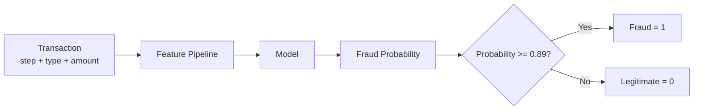
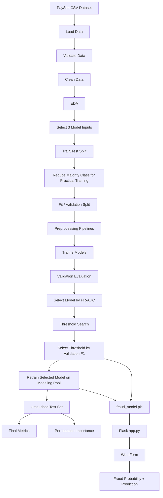
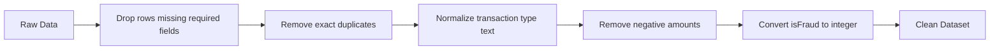
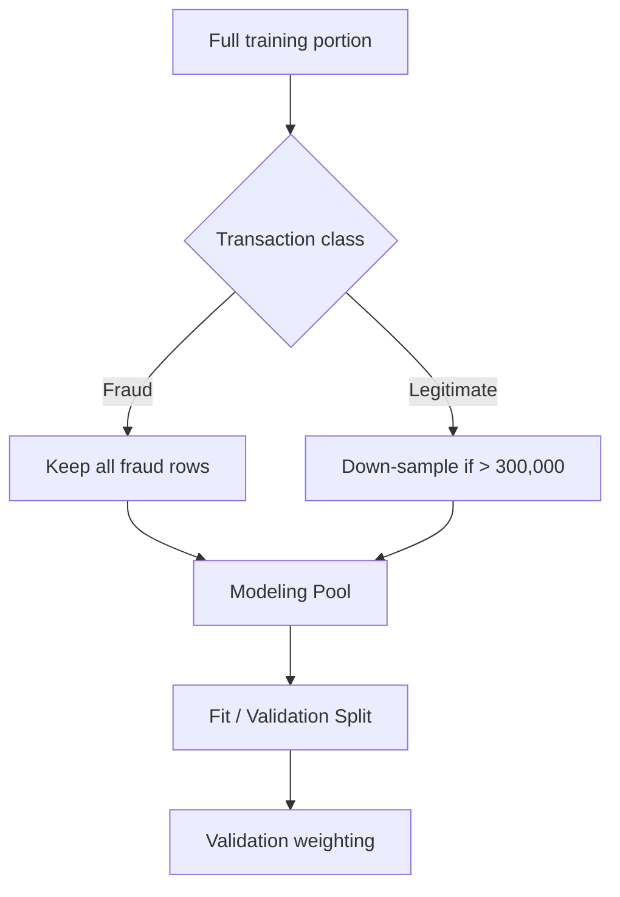
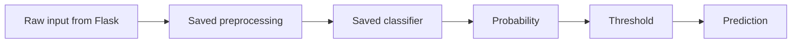
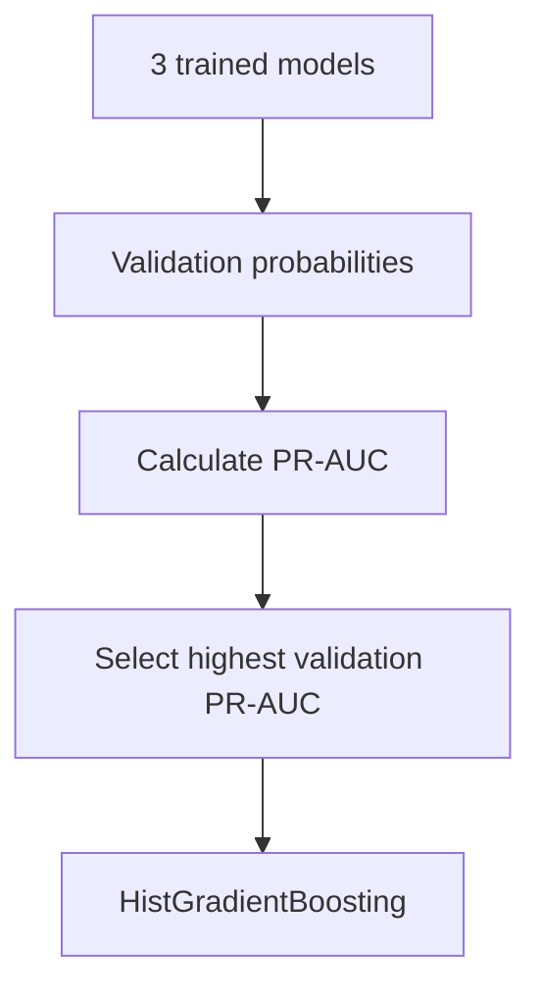
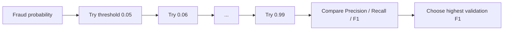
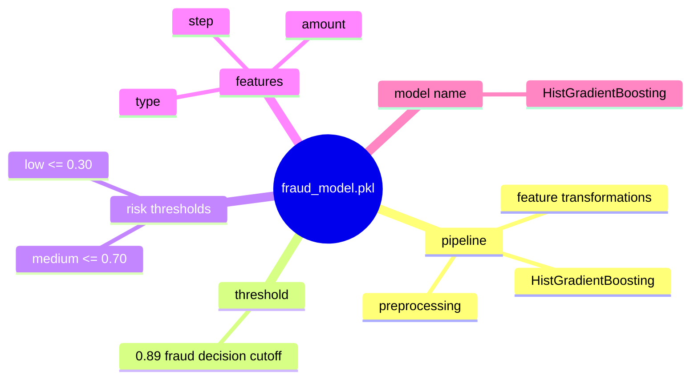
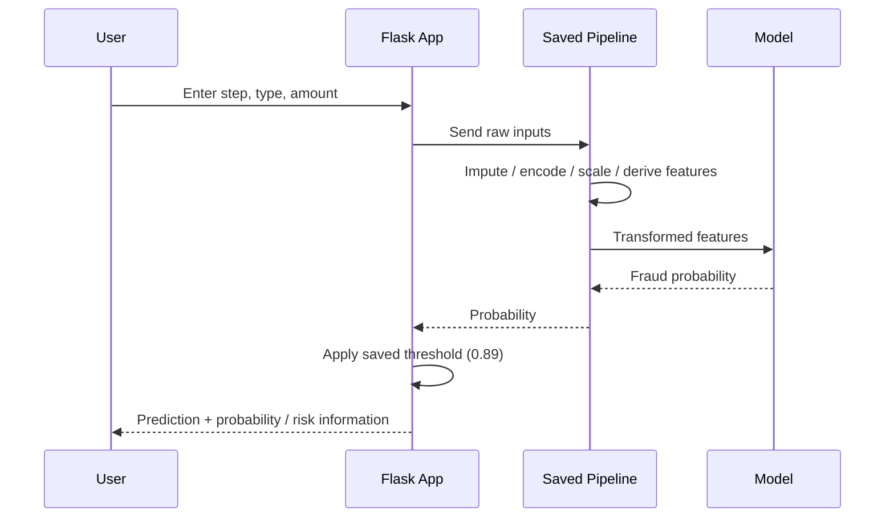
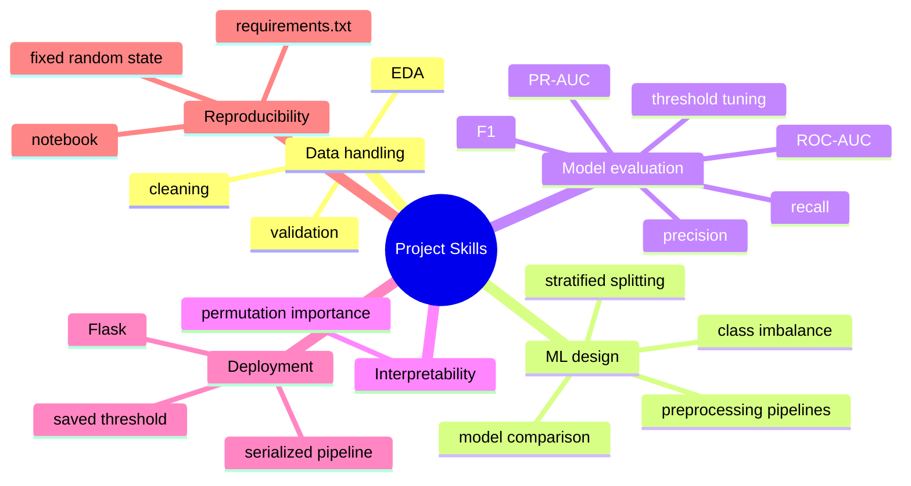

# Intelligent Payment Fraud Detection System

An end-to-end machine learning system for detecting potentially fraudulent payment transactions using the **PaySim** synthetic transaction dataset.

The project covers the complete ML lifecycle:

> **Raw transaction data → data validation → cleaning → exploratory analysis → feature selection → train/validation/test split → preprocessing → model comparison → threshold tuning → final evaluation → feature interpretation → model export → Flask inference**

The important design goal is that the **same preprocessing used during training is stored together with the trained model**, so the web application can take the same three transaction inputs and produce a prediction without rebuilding the ML pipeline.

> **Dataset note:** PaySim is synthetic data. The reported metrics should not be interpreted as production performance on a real payment network.

---

## 1. What This Project Does

Given a payment transaction, the system estimates the probability that the transaction is fraudulent.

### Inputs used by the model

| Input | Meaning |
|---|---|
| `step` | Hour index in the PaySim simulation |
| `type` | Transaction type such as `PAYMENT`, `TRANSFER`, `CASH_OUT`, `DEBIT`, or `CASH_IN` |
| `amount` | Transaction amount |

The saved model accepts these **three original inputs**. Two additional signals are created internally inside the preprocessing pipeline:

- **Hour of day** = `step % 24`
- **Log amount** = `log(1 + amount)`

So the Flask form does **not** need separate fields for those derived features.

---

## 2. Core Concept — How Everything Works



The important point is that the model does **not** simply learn from raw columns. The saved pipeline performs preprocessing and feature transformation before the classifier produces a probability.

---

## 3. Complete Project Architecture



---

# 4. Machine Learning Pipeline

## Step 1 — Load the dataset

The notebook loads the PaySim CSV and checks its shape and first records before making modeling decisions.

The dataset used in the notebook contains:

- **6,362,620 transactions**
- **11 original columns**
- **8,213 fraud transactions**
- **6,354,407 legitimate transactions**
- Fraud rate: **0.1291%**

This extreme class imbalance is one of the most important characteristics of the project.

---

## Step 2 — Validate the data

Before modeling, the notebook checks:

```text
columns
↓
data types
↓
missing values
↓
duplicate rows
↓
summary statistics
↓
target values
↓
transaction types
↓
negative amounts
↓
zero amounts
```

The observed dataset had:

- no missing values in the original columns
- no exact duplicate rows
- no negative transaction amounts
- target values `0` and `1`
- five transaction types

---

## Step 3 — Clean only what needs cleaning

The cleaning stage intentionally avoids unnecessary transformations.



The required fields for this project are:

```text
step
 type
amount
isFraud
```

In the notebook run, **0 rows were removed** by the cleaning rules.

---

# 5. Exploratory Data Analysis

EDA is used to understand the fraud problem before selecting the model inputs.

### Class imbalance

```text
Legitimate  ██████████████████████████████████████████████
Fraud       ▏
```

Fraud represents only **0.1291%** of all transactions.

This is why the project does not treat accuracy as the primary model-selection signal. A model can obtain very high accuracy while still missing a meaningful portion of the minority fraud class.

### Fraud by transaction type

The notebook observes that fraud is concentrated in specific transaction types:

| Transaction type | Transactions | Fraud count |
|---|---:|---:|
| `CASH_OUT` | 2,237,500 | 4,116 |
| `TRANSFER` | 532,909 | 4,097 |
| `CASH_IN` | 1,399,284 | 0 |
| `DEBIT` | 41,432 | 0 |
| `PAYMENT` | 2,151,495 | 0 |

The notebook also inspects transaction amount distributions and correlations among selected numeric variables.

---

# 6. Why Only Three Inputs Are Used

The model intentionally uses a compact feature set so that the deployed web form stays simple.

```text
                   MODEL INPUTS
                       │
          ┌────────────┼────────────┐
          ↓            ↓            ↓
        step          type        amount
          │                          │
          ↓                          ↓
    step % 24                  log(1 + amount)
          │                          │
          └────────────┬─────────────┘
                       ↓
                Model features
```

### Explicitly excluded columns

The notebook does **not** use:

- `nameOrig` — treated as an identifier
- `nameDest` — treated as an identifier
- `isFlaggedFraud` — already an existing rule-based flag
- balance columns — omitted because the notebook notes a specific PaySim documentation caveat regarding their use for fraud detection

This keeps the deployment interface small and makes the saved model easier to use from Flask.

---

# 7. Handling the Extreme Class Imbalance

The original dataset contains millions of legitimate transactions but only a few thousand fraud cases.

Training on the entire majority class would be unnecessarily large for this project, so the notebook uses the following strategy:



The legitimate training class is capped at **300,000 rows** when necessary.

Because down-sampling changes the class proportions, the validation metrics use weights for legitimate examples so that the validation evaluation reflects the original fraud prevalence more closely.

The final test set is **not down-sampled** and remains untouched until final evaluation.

---

# 8. Train / Validation / Test Design

The notebook first creates a stratified 80/20 split:

```text
All data
   │
   ├── 80% → training side
   │          │
   │          └── majority-class reduction → modeling pool
   │                          │
   │                          └── 80/20 → fit + validation
   │
   └── 20% → final test set (untouched)
```

Observed sizes in the notebook:

| Split | Rows |
|---|---:|
| Full training side | 5,090,096 |
| Modeling pool | 306,570 |
| Fit set | 245,256 |
| Validation set | 61,314 |
| Final test set | 1,272,524 |

The final test set is only used after model selection and threshold tuning are complete.

---

# 9. Preprocessing Pipeline

Different data types require different transformations.

## Numeric inputs

`step` and `amount` use:

```text
missing values
      ↓
median imputation
      ↓
standard scaling
```

## Categorical input

`type` uses:

```text
missing category
      ↓
most-frequent imputation
      ↓
one-hot encoding
```

## Derived hour feature

```text
step
 ↓
step % 24
 ↓
24 possible hour values
 ↓
one-hot encoding
```

## Derived amount feature

```text
amount
 ↓
log(1 + amount)
 ↓
median imputation
 ↓
standard scaling
```

### Why the preprocessing lives inside the model pipeline

This is one of the most important implementation details in the repository.



The deployment code therefore does not need to manually reproduce training transformations. The same pipeline used during training is serialized inside `fraud_model.pkl`.

---

# 10. Models Compared

The notebook trains three classifiers:

```text
                    MODEL COMPARISON
                           │
        ┌──────────────────┼──────────────────┐
        ↓                  ↓                  ↓
Logistic Regression   Random Forest   HistGradientBoosting
```

### 1. Logistic Regression

Used as a simple baseline classifier with class balancing.

### 2. Random Forest

An ensemble of decision trees using class-balanced sampling.

### 3. HistGradientBoosting

A gradient-boosting model used with its own compact preprocessing representation.

All three models receive the appropriate preprocessing pipeline before fitting.

---

# 11. Model Selection

The validation set is used to compare the models.

The project uses **PR-AUC (Precision-Recall Area Under the Curve)** as the model-selection metric because fraud is a very rare class.



For this run, the selected model was:

**HistGradientBoosting**

The final exported artifact therefore contains the HistGradientBoosting pipeline.

---

# 12. Threshold Tuning

A classifier's probability is not automatically a final `fraud / legitimate` decision.

The notebook first computes fraud probabilities and then searches thresholds from **0.05 to 0.99**.



The selected validation threshold was:

**0.89**

So the final decision rule is approximately:

```text
probability >= 0.89  → Fraud
probability <  0.89  → Legitimate
```

The threshold is chosen using the **validation set**, not the final test set.

---

# 13. Final Test Results

The untouched test set contains:

- **1,272,524 total transactions**
- **1,643 fraud cases**
- **1,270,881 legitimate cases**

Final test metrics from the notebook run:

| Metric | Result |
|---|---:|
| Precision | **0.7442** |
| Recall | **0.4090** |
| F1 Score | **0.5279** |
| ROC-AUC | **0.9736** |
| PR-AUC | **0.5009** |

The classification report reports the fraud class as:

| Class | Precision | Recall | F1 |
|---|---:|---:|---:|
| Legitimate | 1.00 | 1.00 | 1.00 |
| Fraud | 0.74 | 0.41 | 0.53 |

The displayed accuracy is approximately **1.00**, but this should not be read in isolation because the dataset is extremely imbalanced.

---

# 14. What the Final Metrics Mean

### Precision = 0.7442

Among transactions classified as fraud, about 74% were actually fraud in this test evaluation.

### Recall = 0.4090

The model detected about 41% of the fraud cases in the final test set.

### F1 = 0.5279

F1 combines precision and recall into a single harmonic-mean measure.

### ROC-AUC = 0.9736

Measures ranking/separation performance across classification thresholds.

### PR-AUC = 0.5009

Focuses on precision-recall behaviour, which is particularly informative for this highly imbalanced problem.

---

# 15. Feature Importance

The notebook uses **permutation importance** on a sample of the final test set.

Important: permutation importance shows how the chosen evaluation score changes when a feature is shuffled. It does **not** prove that the feature causes fraud.

Observed mean importances in this run:

| Feature | Mean importance |
|---|---:|
| `type` | 0.253520 |
| `step` | 0.248987 |
| `amount` | 0.243643 |

The three values are relatively close in this run, so all three inputs contribute to the model's ranking behaviour.

---

# 16. Model Export — `fraud_model.pkl`

The project saves one serialized artifact instead of saving only the classifier.

```python
{
    "pipeline": final_pipeline,
    "threshold": best_threshold,
    "risk_thresholds": {
        "low_max": 0.30,
        "medium_max": 0.70
    },
    "features": ["step", "type", "amount"],
    "model_name": "HistGradientBoosting"
}
```

Conceptually:



This means the Flask application can load **one file** and obtain everything required for inference.

---

# 17. Flask Inference Flow

The intended web-application flow is:



### Important deployment principle

The application should use the **saved artifact** rather than creating a new model when a user submits the form.

That keeps training and inference consistent:

```text
TRAINING
raw input → preprocessing → model → save

INFERENCE
raw input → same preprocessing → same model → prediction
```

---

# 18. Repository Structure

Recommended final GitHub structure:

```text
intelligent-payment-fraud-detection/
│
├── app.py
├── README.md
├── requirements.txt
├── LICENSE
├── .gitignore
│
├── models/
│   └── fraud_model.pkl
│
├── notebooks/
│   └── Intelligent_Payment_Fraud_Detection_System.ipynb
│
├── templates/
│   └── index.html
│
└── static/
    └── style.css
```

### Dataset directory

The notebook expects:

```text
../data/PS_20174392719_1491204439457_log.csv
```

For a public GitHub repository, the raw dataset does **not** need to be committed if it is large. See the GitHub upload section below.

---

# 19. How to Run the Project Locally

## 1. Clone the repository

```bash
git clone <your-repository-url>
cd intelligent-payment-fraud-detection
```

## 2. Create a virtual environment

### Windows

```bash
python -m venv .venv
.venv\\Scripts\\activate
```

### macOS / Linux

```bash
python3 -m venv .venv
source .venv/bin/activate
```

## 3. Install dependencies

```bash
pip install -r requirements.txt
```

## 4. Make sure the model artifact exists

The Flask application needs:

```text
models/fraud_model.pkl
```

If you are using the repository only for inference, the exported model is sufficient; you do not need to retrain the model every time you run the web application.

## 5. Start the Flask application

```bash
python app.py
```

Then open the local URL printed by Flask in your browser.

---

# 20. Reproducing the Model Training

The notebook is the complete training workflow.

Before running it, make sure the PaySim CSV is available at:

```text
project-root/
├── data/
│   └── PS_20174392719_1491204439457_log.csv
└── notebooks/
    └── Intelligent_Payment_Fraud_Detection_System.ipynb
```

Then run the notebook from the `notebooks/` directory or preserve the relative path expected by the notebook.

Training will:

```text
Load CSV
  ↓
Validate
  ↓
Clean
  ↓
EDA
  ↓
Select step/type/amount
  ↓
Split data
  ↓
Build preprocessing pipelines
  ↓
Train Logistic Regression
Random Forest
HistGradientBoosting
  ↓
Compare validation PR-AUC
  ↓
Select HistGradientBoosting
  ↓
Tune threshold
  ↓
Select threshold 0.89
  ↓
Evaluate on untouched test set
  ↓
Permutation importance
  ↓
Save fraud_model.pkl
```

---

# 21. GitHub — What You Should Upload

## Upload these files

### Required for the web application

```text
app.py
models/fraud_model.pkl
templates/index.html
static/style.css
requirements.txt
README.md
```

### Strongly recommended for the project / portfolio

```text
notebooks/Intelligent_Payment_Fraud_Detection_System.ipynb
LICENSE
.gitignore
```

Keeping the notebook makes the project reproducible and lets a reviewer inspect the complete ML workflow.

## Do NOT upload

```text
__pycache__/
*.pyc
.venv/
env/
.env
.ipynb_checkpoints/
.DS_Store
```

Also do not upload API keys, passwords, access tokens, or other secrets.

---

# 22. What About the PaySim CSV?

The repository does **not** need the raw CSV to demonstrate the trained Flask application if `fraud_model.pkl` is already included.

For a clean portfolio repository, a practical layout is:

```text
GitHub
│
├── source code
├── notebook
├── trained model
└── documentation

Dataset
└── downloaded separately by the user when retraining
```

If you decide to store a large dataset in GitHub, check its size first. GitHub blocks regular Git files larger than **100 MiB**; GitHub recommends Git LFS for large files. Browser uploads have a lower per-file limit.

For this project, keeping the raw CSV outside the normal Git history is usually cleaner than putting a multi-million-row dataset directly into the repository.

---

# 23. Recommended `.gitignore`

Use something close to:

```gitignore
# Python
__pycache__/
*.py[cod]
*.pyo

# Virtual environments
.venv/
venv/
env/

# Jupyter
.ipynb_checkpoints/

# Environment / secrets
.env
.env.*

# OS files
.DS_Store
Thumbs.db

# Local data
# Uncomment if the PaySim dataset is kept only locally:
# data/

# Temporary / generated files
*.log
```

Do **not** ignore `models/fraud_model.pkl` if you want the GitHub repository to run immediately without retraining.

---

# 24. Portfolio-Level Takeaways

The project demonstrates more than simply training a classifier.



The key engineering idea is the connection between **training and deployment**:

> **The exact preprocessing + trained model + decision threshold are exported together, allowing the Flask application to use the trained system directly.**

---

# 25. Limitations

This project is intentionally an educational / portfolio system, so the following limitations matter:

1. **PaySim is synthetic data.** Results are not evidence of production performance on real payment traffic.
2. **The model uses only three original inputs.** The compact interface is a deliberate design choice.
3. **Fraud is extremely rare.** Accuracy is therefore not sufficient for evaluating the detector.
4. **The final threshold is validation-selected.** Changing the business cost of false positives vs. false negatives could justify a different threshold.
5. **Permutation importance is interpretive, not causal.** It indicates sensitivity of the evaluation score to feature shuffling, not why fraud happens.

---

# 26. One-Page Mental Model

```text
                    INTELLIGENT PAYMENT FRAUD DETECTION
                                     │
                ┌────────────────────┴────────────────────┐
                │                                         │
             TRAINING                                  DEPLOYMENT
                │                                         │
        PaySim synthetic data                        User enters
                │                               step + type + amount
                ↓                                         │
           Clean + EDA                                    ↓
                │                                  Saved pipeline
                ↓                                         │
       Keep step/type/amount                               ↓
                │                                  Fraud probability
                ↓                                         │
     Create hour + log(amount)                             ↓
                │                                   Apply threshold
                ↓                                         │
    Fit 3 classification models                            ↓
                │                                  Fraud / Legitimate
                ↓
     Select model using PR-AUC
                │
                ↓
       Tune threshold using F1
                │
                ↓
        Evaluate untouched test
                │
                ↓
         Save fraud_model.pkl
                │
                └──────────────────────→ Flask app
```

---

## License

See [`LICENSE`](LICENSE).

## Project Status

Educational / portfolio machine learning project demonstrating an end-to-end fraud-detection workflow from dataset analysis through deployment.
